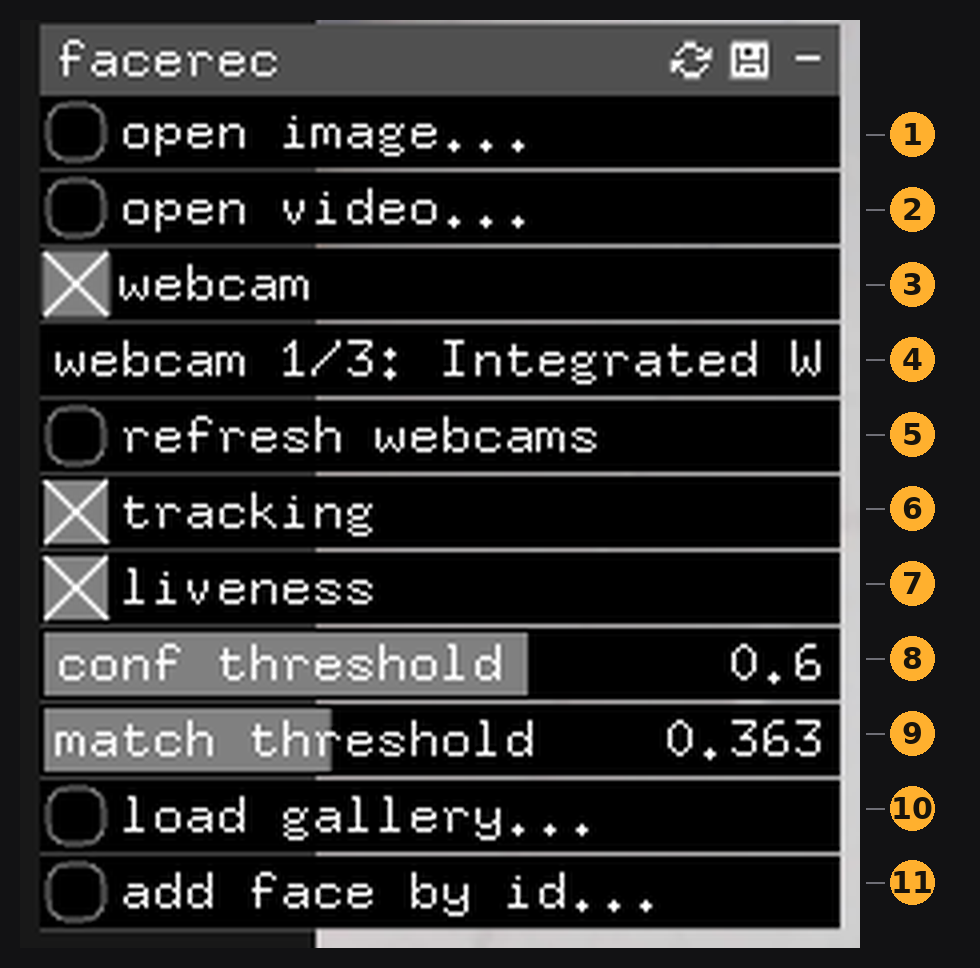
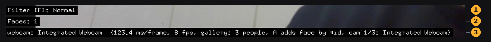
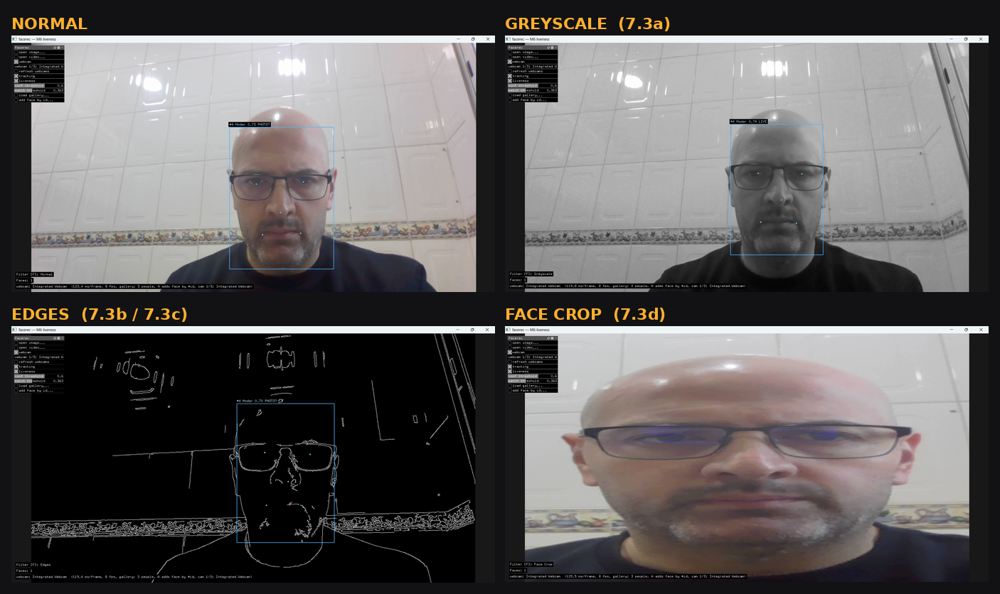

# facerec — User Manual

How to use the application. It assumes you have already built it. For building it on Windows, see
[`SETUP_WINDOWS.md`](SETUP_WINDOWS.md).

`facerec` finds faces in an image, a video file or a live webcam feed, matches them against a
gallery of known people, gives each face a stable ID across frames, and flags whether it has a live
person or a photograph in front of it.

**Contents:** [1 Starting](#1-starting-the-app) · [2 Control panel](#2-the-control-panel) ·
[3 Shortcuts](#3-keyboard-shortcuts) · [4 Reading the screen](#4-reading-the-screen) ·
[5 Still images](#5-still-images) · [6 The two thresholds](#6-the-two-thresholds) ·
[7 Webcam](#7-webcam) · [8 Video](#8-video-files) · [9 Tracking](#9-face-tracking) ·
[10 Liveness](#10-liveness) · [11 Gallery](#11-the-gallery) · [12 Filters](#12-display-filters) ·
[13 Command line](#13-command-line-mode) · [14 Troubleshooting](#14-troubleshooting)

---

## 1. Starting the app

Open an MSYS2 MinGW64 shell and run the executable:

```bash
cd /c/Users/<you>/cc2-face-recognition/facerec/bin
./facerec.exe
```

Start it this way. Double-clicking `facerec.exe` in Explorer leaves it without the MSYS2 libraries
it needs.


The terminal lists what loaded: the YuNet detection model, the SFace recognition model, how many
people are in the gallery, and which cameras it found. Load errors appear here and nowhere else, so
keep the terminal where you can see it. A window titled **facerec — M6 liveness** opens next.

---

## 2. The control panel

The panel sits top-left. Drag its title bar to move it, click `—` at its right to collapse it.



| # | Control | What it does |
|---|---------|--------------|
| 1 | **open image...** | Opens a still image and runs detection on it. Same as `O`, or drag a file onto the window. |
| 2 | **open video...** | Opens a video file and starts playback. Detection runs on every frame. |
| 3 | **webcam** | Turns the live webcam feed on and off. |
| 4 | **webcam 1/3: …** | Which camera is in use. Click to change, or press `[` / `]`. |
| 5 | **refresh webcams** | Re-scans for cameras. Use after plugging one in. |
| 6 | **tracking** | Gives each face a stable `#id` that follows it between frames. Required for liveness. |
| 7 | **liveness** | Turns on the `LIVE` / `PHOTO?` check. Does nothing unless **tracking** is on. |
| 8 | **conf threshold** | How certain the detector must be before reporting a face. Default `0.60`. See §6. |
| 9 | **match threshold** | How similar a face must be before it is given a name. Default `0.363`. See §6. |
| 10 | **load gallery...** | Points the app at a folder of known people, one subfolder per person. |
| 11 | **add face by id...** | Adds a face on screen to the gallery. Same as `A`. See §11. |

---

## 3. Keyboard shortcuts

| Key | Action |
|-----|--------|
| `O` | Open an image or video |
| `A` | Add the face on screen to the gallery |
| `F` | Cycle the display filter (§12) |
| `[` `]` | Previous / next webcam |
| `Space` | Pause and resume video playback |

You can also drag an image or video file onto the window.

---

## 4. Reading the screen

### The label above each face


| Part | Meaning |
|------|---------|
| `#4` | Tracking ID. Stays with this face while it stays visible. Shown only when **tracking** is on. |
| `Modar` | Closest gallery match. Reads `unknown` when nothing scores above the match threshold. |
| `0.70` | Similarity to that gallery entry, 0 to 1. Higher is a better match. |
| `PHOTO?` | Liveness verdict. See §10. |

The box turns **blue** once the app puts a name on the face, and stays **green** while it cannot.
The five dots are the landmarks the detector found: two eyes, nose tip, two mouth corners.

### The status lines along the bottom



| # | Line | Meaning |
|---|------|---------|
| 1 | `Filter [F]: …` | Active display filter |
| 2 | `Faces: …` | Faces found in this frame |
| 3 | `webcam: … (… ms/frame, … fps, gallery: … people, …)` | Active source, processing time per frame, frame rate, people loaded |

Around **8 fps** on a live webcam is normal. The models run on the CPU rather than the GPU.

---

## 5. Still images

Use **open image...**, press `O`, or drag a file onto the window.


One face, boxed, with the five landmarks placed. `unknown` here means the person is not in the
gallery.


The app puts no practical limit on how many faces it finds at once. It reports 22 in this photo.


An image with no faces gives `Faces: 0` and no boxes. Nothing has gone wrong.


Dragging a file from Explorer onto the window does the same as opening it from the panel.

---

## 6. The two thresholds

These are the only two controls that change what the app reports. Everything else changes what you
see.

### conf threshold: *is this a face at all?*


The detector scores every candidate and throws away anything below this value. Drop it from `0.60`
to `0.41` on the same photo and two more faces appear, small or dim or partly turned ones that sat
just under the bar. Drop it far enough and the detector starts boxing things that are not faces.

### match threshold: *whose face is it?*


The recogniser finds the closest gallery entry every time. This threshold decides whether that entry
sits close enough to put a name on. Raise it and borderline matches fall back to `unknown`. Lower it
and the app hands out names it has no business handing out. Default `0.363`.

If the app misses a face altogether, reach for **conf threshold**. If it finds the face but gets the
name wrong, or gives none at all, reach for **match threshold**.

---

## 7. Webcam

Tick **webcam**. The feed starts and detection runs on every frame.


Switch cameras with `[` and `]`, or click control 4. The panel shows which camera is active.


A black window after switching points to a virtual camera with no feed rather than a crash. Switch
back with `[` or `]`. If a camera you have just plugged in is missing, press **refresh webcams**.

---

## 8. Video files

Use **open video...**, or press `O` and pick a video. `Space` pauses and resumes.


Detection, recognition, tracking and liveness work as they do on a webcam. Frame rates run far
higher, often past 140 fps, since a video file has no real-time limit to keep to.

> If a video opens to a black screen and the terminal mentions DirectShow codecs, Windows is missing
> an MP4 decoder. Install the free K-Lite Codec Pack.

---

## 9. Face tracking

Tick **tracking**. Each face gets a `#id` that stays with it.


The ID survives ordinary movement. Turn, tilt, lean in and out, and it holds:


It does not survive a long disappearance. Leave the frame for more than about two seconds, or walk
far enough away for the detector to lose you, and you come back as a **new** ID:


Two faces get two independent IDs at the same time:


> **A tracking ID says nothing about who you are.** `#4` means "the fourth face this session". The
> gallery name beside it is what identifies the person.

---

## 10. Liveness

Tick **tracking** first, then **liveness**. Liveness reads blinks and mouth movement across frames,
so it cannot work without tracking.


| Verdict | When it appears |
|---|---|
| `PHOTO?` | No blink or mouth movement for a few seconds. The app suspects a still photograph. |
| `LIVE` | A blink or mouth movement was detected. Persists for a short window, then lapses back to `PHOTO?`. |

Sit still for long enough and the app flags you as a photo. The check is doing its job there. Blink,
or open and close your mouth, and the label flips to `LIVE`.

Glasses make blinks harder to see, since the frames and reflections disturb the eye region. Blink
hard, or use mouth movement instead.

---

## 11. The gallery

The gallery is a folder with one subfolder per person, named after them. Point the app at it with
**load gallery...**. The status line reports how many people loaded.

To add someone without leaving the app:


1. Turn on **webcam** and **tracking**
2. Wait for a box with an `#id` on the face
3. Press `A` (or **add face by id...**), type the `#id` shown, then the name to store it under
4. The app writes the crop into the gallery folder and matches against it from then on

Several photos per person, taken in different lighting, beat a single one.

---

## 12. Display filters

Press `F` to cycle four ways of drawing the frame. Detection and recognition run on the original
frame underneath, so boxes, names and scores stay correct whichever mode you pick.



| Mode | What you see |
|------|--------------|
| **Normal** | The frame as the camera sees it |
| **Greyscale** | Colour removed |
| **Edges** | Canny edge detection, white outlines on black |
| **Face crop** | Zoomed into the largest detected face |

The app hides the overlays in **face crop** on purpose. The frame is zoomed there, so boxes drawn in
original frame coordinates would land in the wrong place. Watch the `Faces:` counter keep updating
and you can see detection still running underneath.

---

## 13. Command line mode

The app also runs without a window, for checking an install or working through a batch of files. Run
these from `facerec/bin` in an MSYS2 MinGW64 shell.

```bash
./facerec.exe --detect samples/messi5.jpg          # count and score faces
./facerec.exe --identify samples/messi-worldcup.jpg # name faces against the gallery
./facerec.exe --liveness-replay <video>            # LIVE / PHOTO? verdict over a video
```

Paths for `--detect` and `--identify` resolve under `facerec/bin/data/`, so `samples/messi5.jpg` is
correct and `data/samples/messi5.jpg` is not. `--liveness-replay` is the exception: it hands the
path straight to OpenCV, so give it an absolute path or one relative to `facerec/bin`.

The build script also runs a self-test covering the models, the tracker and the liveness detector:

```bash
python3 scripts/build.py --check
```


---

## 14. Troubleshooting

| What you see | Likely cause |
|---|---|
| `libfreeimage-3.dll` error on launch | Launched from Windows Explorer. Use an MSYS2 MinGW64 shell. |
| Black screen after switching camera | That device is a virtual camera with no feed. Switch back with `[` or `]`. |
| Video will not play, black screen | Windows is missing an MP4 codec. Install the K-Lite Codec Pack. |
| A camera is missing from the list | Press **refresh webcams**. |
| Label shows a name but no `#id` | **tracking** is off. |
| `LIVE` never appears | **liveness** needs **tracking** on as well. |
| Everyone is `unknown` | Gallery not loaded, or **match threshold** set too high. |
| Wrong name on a face | **match threshold** set too low. |
| A face is not detected at all | Lower **conf threshold**, or improve the lighting. |
| Around 8 fps on webcam | Expected. The models run on the CPU. |

[`KNOWN_ISSUES.md`](KNOWN_ISSUES.md) covers each of these at length, along with the limitations that
are not bugs.

---

*For building the project on Windows see `SETUP_WINDOWS.md`; for test scenarios and results see
`TESTING.md` and `RESULTS.md`.*
